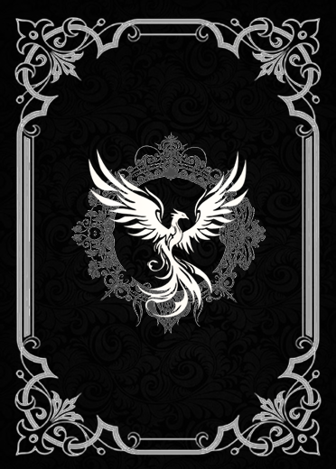
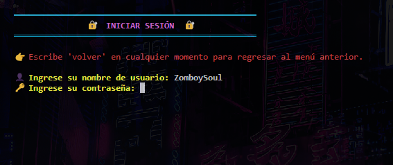
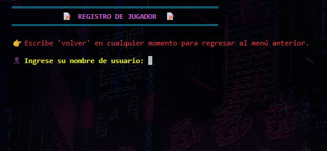
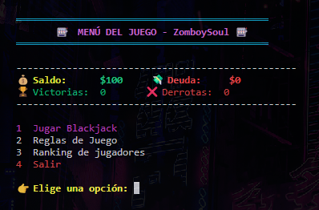
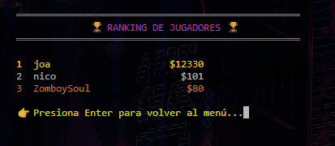
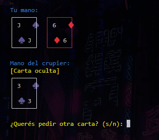
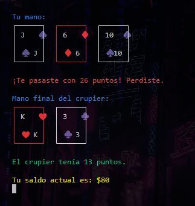

<p align="center">
  
</p>

<h1 align="center">BALITH GAME</h1>

---

<p align="center">
Balith es una versión clásica del Blackjack donde el jugador compite contra el crupier (la banca) para alcanzar 21 puntos sin pasarse. El juego permite apostar, llevar registro de partidas ganadas, y ofrece una experiencia visual mejorada para consola gracias a módulos como `colorama`.
Además, cuenta con un sistema de usuarios que se guarda en un archivo **JSON** a modo de base de datos local.
</p>

<p align="center">
  
  
  
  
  
  
</p>

<br>

<p align="center">
  <a href="https://github.com/ZomboySoul/fnaf_signal_lost/issues/new?assignees=&labels=bug&projects=&template=bug_report.yml" target="_blank" rel="noopener noreferrer">Reportar Bug</a>
</p>
<!-- <p align="center">
  <a href="docs/README_fr.md">Français</a> ·  
  <a href="docs/README_cn.md">简体中文</a> ·
  <a href="docs/README_es.md">Español</a> ·
  <a href="docs/README_ja.md">日本語</a> ·
  <a href="docs/README_pt-BR.md">Português Brasileiro</a> ·
  <a href="docs/README_it.md">Italiano</a>
</p> -->

<br>

## 🧠 Características

- Blackjack clásico contra la banca.
- Sistema de usuarios con almacenamiento persistente.
- Estadísticas personales por jugador.
- Animaciones y texto decorado en consola.
- Modularización completa del código para mayor limpieza y escalabilidad.
- Funcionlidad de prestamos a la banca
- Posibilidad de expandir con nuevas funcionalidades (logros, torneos,etc.).

---

## 🎮 Cómo Jugar

```bash
# Clona el repositorio
git clone https://github.com/zomboysoul/Balit_Game.git
cd Balit_Game

# Python 3.10 y Colorama
#Instálalo con:

pip install colorama

# Ejecuta el juego
python main.py

```

---

## 📁 Estructura del Proyecto

```bash
.
├── interzas.py
├── juego.py
├── jugadores.py
├── jugadores.json
├── main.py
└── utils.py
```

| Archivo                  | Descripción                                                                                                                                                                                      |
| :----------------------- | :------------------------------------------------------------------------------------------------------------------------------------------------------------------------------------------------ |
| **main.py**        | Archivo principal que inicia y controla el flujo general del juego. Desde aquí se cargan los usuarios, se inicializan las partidas y se manejan los menús principales.                          |
| **juego.py**       | Contiene la lógica central del juego: reparto de cartas, control de turnos, verificación de ganadores y cálculo de puntajes.                                                                   |
| **jugadores.py**   | Maneja todo lo relacionado a los jugadores: crear nuevos usuarios, actualizar información, consultar saldo, registrar estadísticas. Interactúa directamente con el archivo `jugadores.json`. |
| **jugadores.json** | Actúa como base de datos local. Aquí se almacenan los datos de los usuarios: nombre, saldo, estadísticas de partidas, y demás información persistente.                                       |
| **interzas.py**    | Encargado de las interfaces visuales en consola. Desde menús, mensajes decorados hasta animaciones de inicio o resultados.                                                                       |
| **utils.py**       | Funciones auxiliares y utilitarias que asisten a los demás módulos, como validaciones, generación de cartas, formateo de texto y colores para consola.                                         |

---

## 📸 Captura de Pantalla













---

## 🧑‍💻 Programador - Creador

**Agustín Lezcano - ZomboySoul**
🔗 [GitHub](https://github.com/ZomboySoul) | 🇦🇷 Argentina
